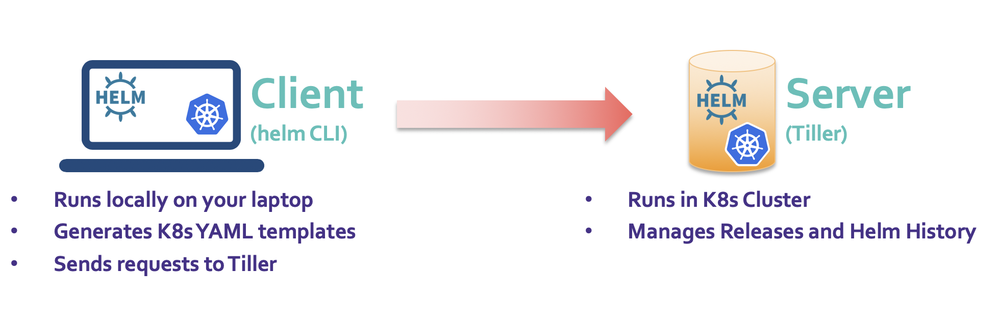
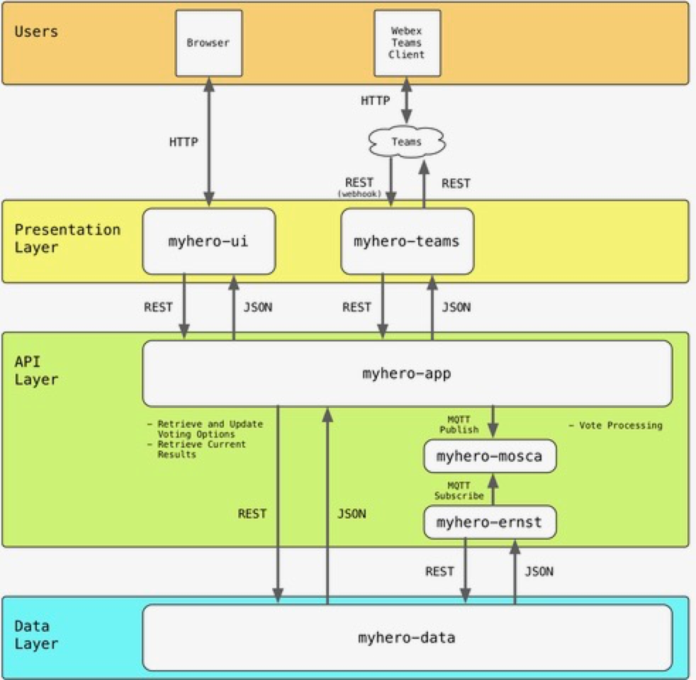
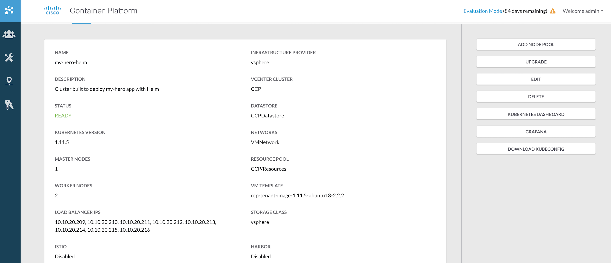
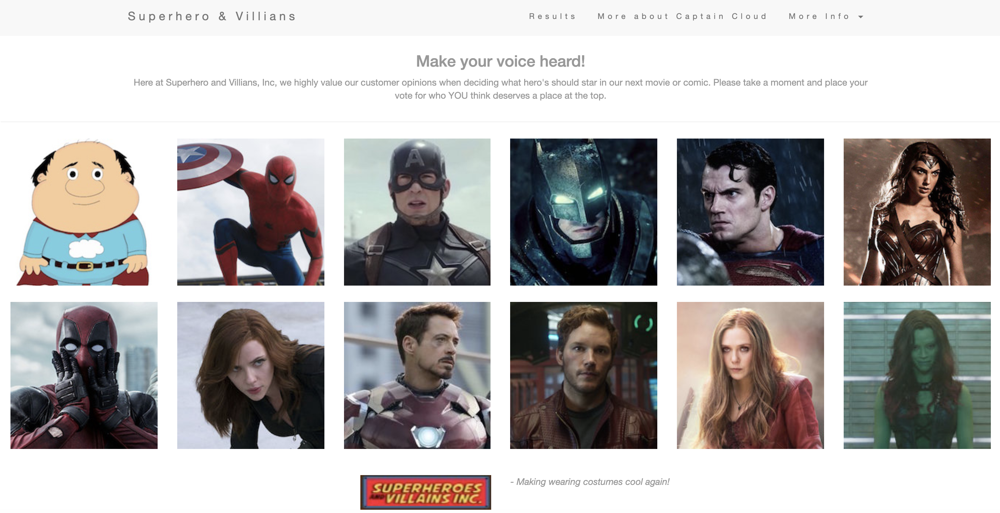
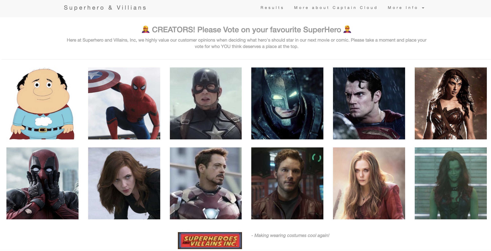

[](https://developer.cisco.com/codeexchange/github/repo/JPedro2/myhero-app-helm)

# Introduction
This demo was developed for [DevNet Create19](https://developer.cisco.com/devnetcreate/2019/) and it aims to demonstrate
the power of Helm when deploying an application with several microservices.
If you are new to the DevOps world and wish to know more about microservices, containers and Kubernetes, I highly recommend that you follow this amazing [DevOps tutorial](https://github.com/juliogomez/devops/) developed by [Julio Gomez](https://twitter.com/juliodevops).

# Helm
[Helm](https://helm.sh/) is a tool that streamlines installing and managing Kubernetes applications.
Think of it like apt/yum/homebrew for Kubernetes.

<p align="center"> 

</p>

- Helm has two parts: a client (`helm`) and a server (`tiller`)
- Tiller runs inside of your Kubernetes cluster, and manages releases of your charts.
- Helm runs on your laptop, CI/CD, or wherever you want it to run.
- Charts are Helm packages that contain at least two things:
  - A description of the package (`Chart.yaml`)
  - One or more templates, which contain Kubernetes manifest files
- Charts can be stored on disk, or fetched from remote chart repositories
  (like Debian or RedHat packages)

To rapidly get Helm up and running, start with the [Quick Start Guide](https://docs.helm.sh/using_helm/#quickstart-guide).
See the [installation guide](https://docs.helm.sh/using_helm/#installing-helm) for more options.

# myhero Application
[myhero](http://myhero.imapex.io) is an application developed by [Hank Preston](https://twitter.com/hfpreston) for demonstration purposes. 
It is composed by several different microservices, developed in [AngularJS](https://angularjs.org) & [Python](https://www.python.org), 
and packaged with Docker containers. In essence, it allows users to vote for their favorite superhero, and presents 
the summary results for all received votes.

<p align="center"> 

</p>

As the diagram indicates *myhero* has three layers: `Data`, `Applications` and `Presentation`.
* *Data* layer, a microservice composed by a single container that stores the list of available superheros and the number of votes received for each of them.
* *Application* layer, composed by three different microservices. The first and main one is the middleware that processes 
votes from several user interfaces, and stores them in the Data layer. It includes a variable number of load-balanced 
containers depending on the needs of the system. The second and third microservices in this layer (*mosca* and *ernst*) 
are optional, and implement a queueing system to alleviate the pressure when there are multiple votes waiting to be stored in the Data layer.
* *Presentation* layer, composed by several microservices that interact directly with end users. There are two of them: 
a Web User Interface for users to vote via a webpage, and a [WebEx Teams]() (previously known as Spark) Interface for users to 
vote via WebEx Teams. For the purposes of this demo *ONLY* the Web UI is used for users to vote.

You can access the source code of each of these containers from [myhero-app repo](https://github.com/hpreston/myhero_demo).
Additionally, on the [DevOps Handbook developed by Julio Gomez](https://github.com/juliogomez/devops/), mentioned above, 
the architecture and intricacies of this application are also thoroughly explained.


# Pre-requisites

In order to run this demo you will need to have a fully functional Kubernetes cluster running with Helm. If you don't have one already, 
I highly recommend having a look at the *FREE* [DevNet Sandbox of Cisco Container Platform (CCP)](https://devnetsandbox.cisco.com/RM/Diagram/Index/6f419def-1813-481f-a6c6-a469993d4bb0?diagramType=Topology) 
together with [learning labs](https://learninglabs.cisco.com/tracks/cisco-google-cloud/ciscoshipped/CiscoContainerPlatform-101/step/1) 
to learn the basics of [CCP](https://blogs.cisco.com/developer/kubernetes-with-cisco-container-platform), 
its API and, most importantly, deploy a fully functional K8s cluster.

# Setup

By having a close look at the templates folder you will be able to spot that they are pretty similar to K8s 
manifests, with all of the crucial *values* being imported from the `values.yaml` file.

Before you deploy the application there are a two main values on the `values.template` file that you will have to pay 
particular attention to. Since `myhero-ui` service runs *AngularJS*, that means that it runs client-side so the browser will
need to access directly the `myhero-app` service. Therefore, we need to provide an externally accessible address to the `myhero-app` service,
in the form of an environment variable.

To run the application you will need to save the `values.template` file as `values.yaml`. Before you do that **make sure**
you allocate an externally accessible IP to `myhero-app` service and pass this `env` variable to `myhero-ui` service, 
as discussed above. If you are using CCP or a cloud provider (GCP, AWS, etc..), you will be able to allocate external IP 
addresses that can be used by your application. Particularly for CCP, you can view your available `LoadBalancer` IP addresses
from the dashboard, as demonstrated in the picture below.

```yaml
myhero_app:
  name: myhero-app
  replicaCount: 3
  image:
    repo: hpreston/myhero_app
    tag: latest
  containerPort: 5000
  service:
    type: LoadBalancer
    loadBalancerIP: <PROVIDE-EXTERNAL-IP-FOR-myhero-app>
    
myhero_ui:
  name: myhero-ui
  replicaCount: 2
  image:
    repo: hpreston/myhero_ui
    tag: latest
  containerPort: 80
  service:
    type: LoadBalancer
    env:
      ingress: <EXTERNAL-IP-FROM-myhero-app>
```

<p align="center"> 

</p>

## Set Up Kubernetes Context
Regardless if you are using a K8s cluster running on a private/public cloud or on the CCP Sandbox, please
make sure that you are running the correct kubernetes context. If you are using the CCP Sandbox, you will need to download the
`kubeconfig` file from the Dashboard and setup your kubernetes context to the cluster running on CCP. If you wish to find
more on how to access multiple K8s clusters from your local machine, have a look at [this guide](https://kubernetes.io/docs/tasks/access-application-cluster/configure-access-multiple-clusters/).

### Set Up Kubernetes Context for CCP 
If you already have a cluster (using *minikube*, for example), and you can use `kubectl` to interact with the cluster, then you probably have a file named `config` 
in the `$HOME/.kube` directory.
Go to `$HOME/.kube`, and see what files are there. Typically, there is a file named `config`. There might also be other configuration 
files in this directory. 
Now all you have to do is merge your current `config` file with the `kubeconfig` that you downloaded from the CCP dashboard
by using the following commands.

```shell
cp <$PATH-OF-CCP-KUBECONFIG-FILE> ~/.kube
```

```shell
KUBECONFIG=~/.kube/config:~/.kube/kubeconfig.yaml kubectl config view --flatten > mergedkub && mv mergedkub ~/.kube/config
```

Change your current K8s context to the K8s cluster running on CCP and check that confirm that the change took place.

```shell
kubectl config use-context kubernetes-admin@kubernetes
```

```shell
kubectl config current-context
```

## Check Helm is running 

After making sure that you are using the correct K8s context you will need to make sure that Helm is running in your environment.
If you are using the CCP Sandbox, Helm is installed by default but you may need to upgrade the version since the `Client` and 
`Server` (aka `Tiller`) versions must match.

```shell
helm version
```

If the `Client` and `Tiller` versions do not match, you can upgrade the Tiller with the following command. You can then run the
`version` command again to make sure that they both now have the same versions. 

```shell
helm init --upgrade
```

# Deploy myhero-app with Helm

Once you have your K8s cluster up and running with Helm, deploying myhero-app using Helm is quite straight forward 🚀🤓. 
In fact, all you need is a single command.

```shell
helm install myhero-helm/
```

Now go-ahead and check that the application has been deployed, as well as determine the `Release Name`. You will now realise
that *Helm Release Names* are actually random and quite funny 😂

```shell
helm list
```

To find the IP address of myhero-app Web-UI you can check the status of the `Release Name` under services.

 ```shell
helm status <Release-Name>
```

```console
==> v1/Service
NAME                                TYPE          CLUSTER-IP      EXTERNAL-IP   PORT(S)         AGE
jazzed-donkey-myhero-app-service    LoadBalancer  10.110.57.146   10.10.20.210  80:31832/TCP    6d2h
jazzed-donkey-myhero-data-service   NodePort      10.101.126.186  <none>        80:31625/TCP    6d2h
jazzed-donkey-myhero-mosca-service  NodePort      10.98.120.131   <none>        1883:32383/TCP  6d2h
jazzed-donkey-myhero-ui-service     LoadBalancer  10.106.32.188   10.10.20.211  80:30617/TCP    6d2h
```


You can now access this IP address and start voting on your favourite 🦸‍♀️SUPER HERO!🦸‍♂️


<p align="center"> 

</p>


## Update the application and rollback

If you wish to update your application, let's say increase the number of PODs under your myhero-app service, or even 
update the Web-UI, you can do that with Helm with yet again, a single line of code.

You can find the docker container used for this new Web-UI version on [DockerHub](https://cloud.docker.com/u/peolivei/repository/docker/peolivei/myhero-ui-create)


```shell
helm upgrade --set myhero_app.replicaCount=6,myhero_ui.image.repo=peolivei/myhero-ui-create <Release-Name> ./myhero-helm
```

Now check your browser again. Make sure that you hold the SHIFT key when pressing refresh to make sure that you are not using
cached data. If the previous Web-UI is still cached just use incognito mode.
Lastly, re-check the status of the `Release` to make sure that you now have 6 PODs running for the myhero-app service, instead
of 3.

```console
RESOURCES:
==> v1/Pod(related)
NAME                                                    READY  STATUS       RESTARTS  AGE
jazzed-donkey-myhero-app-deployment-98866bb59-756dj     1/1    Running      37        6d2h
jazzed-donkey-myhero-app-deployment-98866bb59-gkbww     1/1    Running      0         7m11s
jazzed-donkey-myhero-app-deployment-98866bb59-hmns6     1/1    Running      46        6d2h
jazzed-donkey-myhero-app-deployment-98866bb59-krrr9     1/1    Running      0         7m11s
jazzed-donkey-myhero-app-deployment-98866bb59-m28r6     1/1    Running      0         7m11s
jazzed-donkey-myhero-app-deployment-98866bb59-vq5c5     1/1    Running      12        6d2h
jazzed-donkey-myhero-data-deployment-9c9b7b96d-h4gvw    1/1    Running      18        6d2h
jazzed-donkey-myhero-ernst-deployment-85c996d9f6-gb794  1/1    Running      7         6d2h
jazzed-donkey-myhero-mosca-deployment-68dddfb5cc-fwmcx  1/1    Running      8         6d2h
jazzed-donkey-myhero-ui-deployment-59f89d6f6c-lcw86     1/1    Running      0         7m11s
jazzed-donkey-myhero-ui-deployment-59f89d6f6c-s59tn     1/1    Running      0         7m11s
```
<p align="center"> 

</p>

Now if you wish to roll back the application to it's previous version, you can easily do it as follows. In case you have not
realised you can check the *Helm Release Version* under `helm list`.

```shell
helm rollback <Helm-Release> <Revision-No.>
```

You can now go back and check on your browser that the Web-UI changed back to the initial version, as well as you can double
check that the number of PODs allocated to the myhero-app service has now been reduced to the original 3.

## Delete the application

Lastly, with Helm you can delete the entire application with yet another single command. This will delete all the `PODs`, `Services`
and `Deployments` previously created.

```shell
helm delete <Helm-Release>
```
